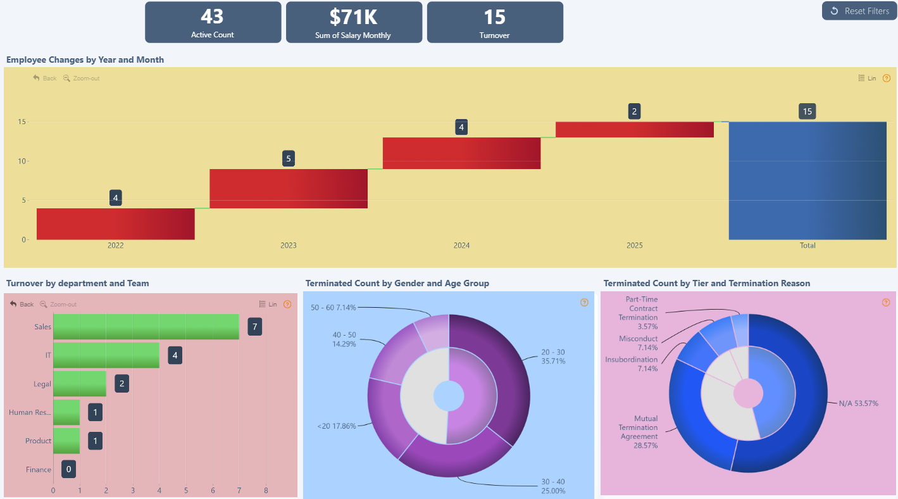

# Employee Turnover Report – Power BI Dashboard

---

## 📷 Dashboard Preview

---

## 📊 Overview
This Power BI dashboard analyzes **Employee Turnover** to help organizations track and understand workforce retention and attrition trends.  
It includes interactive drill-down visuals, cross-chart filtering, and detailed breakdowns by gender, tier, and time period.

---

## 🛠 Features
- **Drill Down Donut** – Visualizes terminated employee count by Gender and Tier.
- **Drill Down Waterfall** – Tracks net changes in employee headcount.
- **Drill Down Combo Bar** – Shows turnover rate by department or other dimensions.
- **On-chart interactions** – Click charts to filter other visuals dynamically.
- **Cross-chart filtering** – Synchronizes filters across visuals for deeper analysis.

---

## 📂 Files
- `Employee_Turnover_Report.pbix` – Power BI dashboard file
- `screenshots/` – Images of the dashboard

---

## 🚀 How to Use
1. Download the `.pbix` file from this repository.
2. Open in [Power BI Desktop](https://powerbi.microsoft.com/desktop/).
3. Interact with charts using drill-down and cross-filtering features.

---